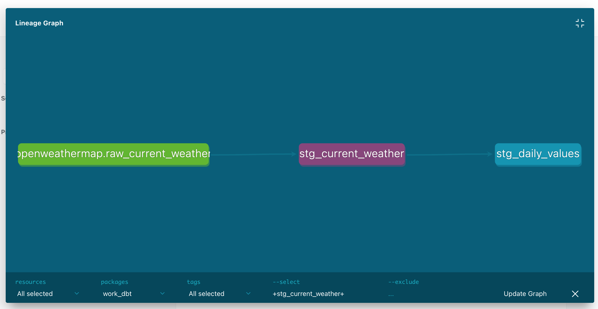
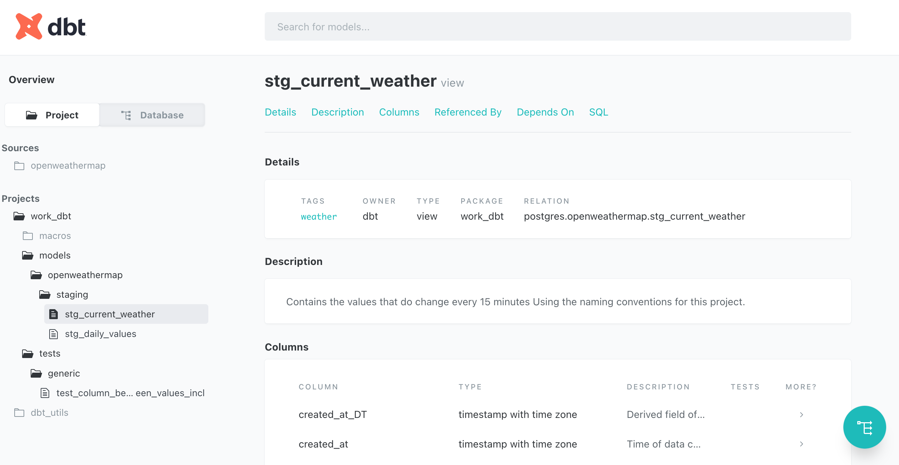
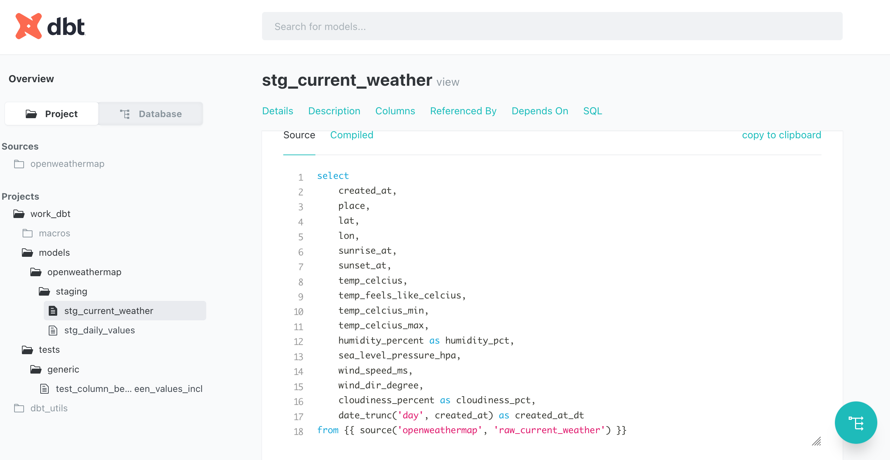
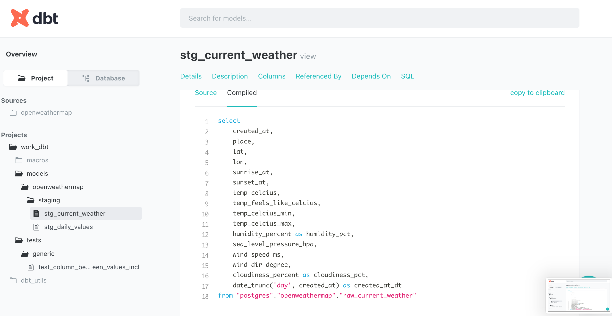
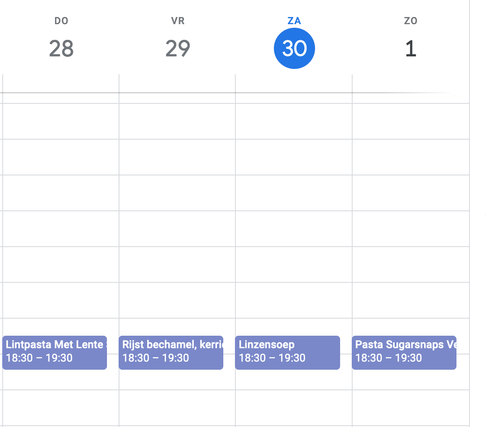
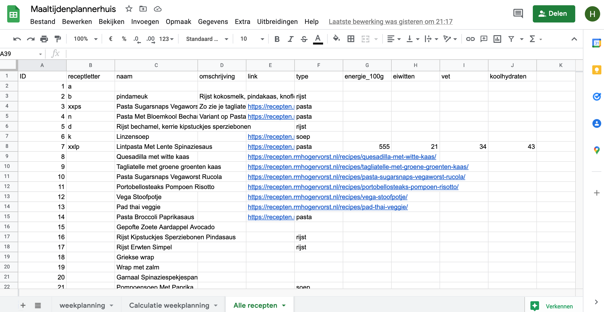
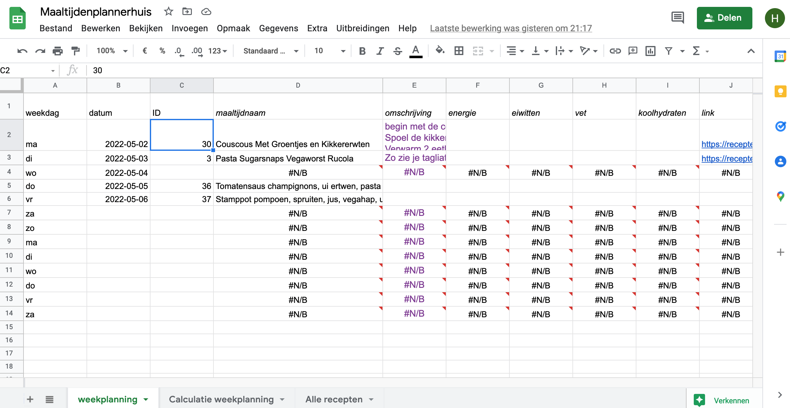

This is an overview of what my 'Smoll data stack' is actually delivering.

The dbt project is run every night (for dbt models with a daily tag)
and weekly (for dbt models with weekly tag)

At moment of writing there is one raw table, a staging daily values dbtmodel and a daily dbtmodel

This is the normal stg_current_weather sql

and this the compiled sql

### writing recipes to calendar
The job write recipes to calendar works on my computer.

All recipes:

Selection for this week

Future improvements:
Suggest recipes automatically
